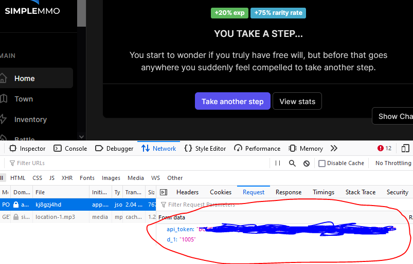

# simple_mmo_simpler_bot
Simpler bot for SimpleMMO

This project is no longer maintained and is/was stable at the date of publishing.
I made this bot for personal educational purposes and I was using it until I got banned.
Cheating is bad and you will get punished!

I am publishing this project for educational and archival purposes only. Seriously, don't cheat!

## Features
* Walking 
* Attacking mobs (bot might be too obvious and that might be the reason I got banned)

## Usage
Restore dependencies:

```
npm install
```

Common usage:
```
node bot.js example@mail.com P4sw0rd
```

You can use -a flag to enable mob fighting. You may get noticed earlier and banned. Use it at your own risk.
```
node bot.js example@mail.com P4sw0rd -a
```

You can use minimal bot which can only walk. You will need walking API token. You can use API token that is printed after bot.js initializes after authentication
ore you can go to web version of this game in the browser and get one from the walk HTTPS request body like shown in the image below.



```
node minimal-bot.js cCHFGrc23tWGTzynGEolacsdM3HExdutEBVpmqbPcszdaQrN9935Iv3KdM7
```

## Insights
From the beginng of the bot development I noticed that walking API absolutely differs from all activities in the game.
I always had a feeling as if they simplified access to walking action so people could try to attempt writing bots (checkout minimal-bot.js).
It was really trivial to analyze walking action and simplest replay attack in the browser just worked. I noticed that they are also sending cursor coordinates
so I just randomized it a little bit to simulate human clicks. After adding some natural delay between walks the minimal bot became pretty stealthy and got me hundreds of levels.